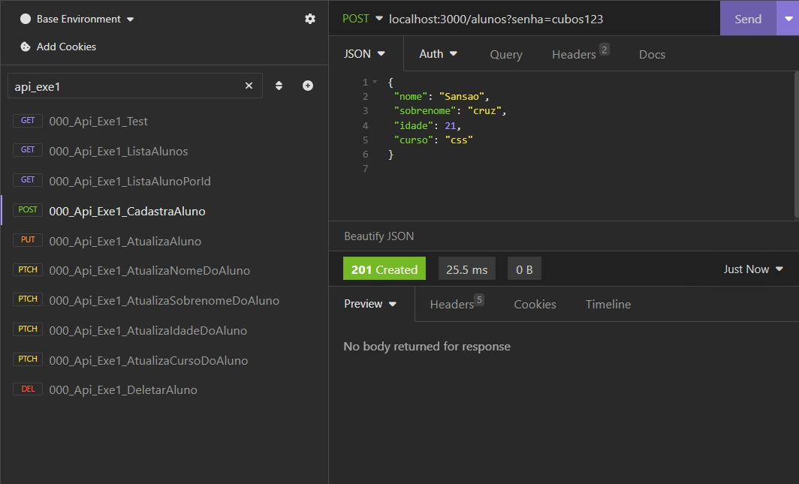

# Back-end | API REST

### Pré-requisitos:
- Node.js

### Instalação:
1. Clone este repositório:
**git clone https://github.com/DevTnbad/JS_Cubos-API-REST**

2. Navegue até o diretório do projeto: 
**cd JS_Cubos-API-REST**

3. instale as dependências:
**npm install**
---
### 1. Cadastro de alunos:

- O que é: 
 API para realização de cadastro de alunos.

- Como executar:
  npm run exe1

### 2. Lista de convidados:

- O que é: 
 API simples de um sistema para controle de convidados de evento.

- Como executar: 
  npm run exe2

---
### 3. Biblioteca Online:

- O que é: 
 API de um sistema para controle de livros em uma biblioteca.

- Como executar: 
  npm run exe3

---
